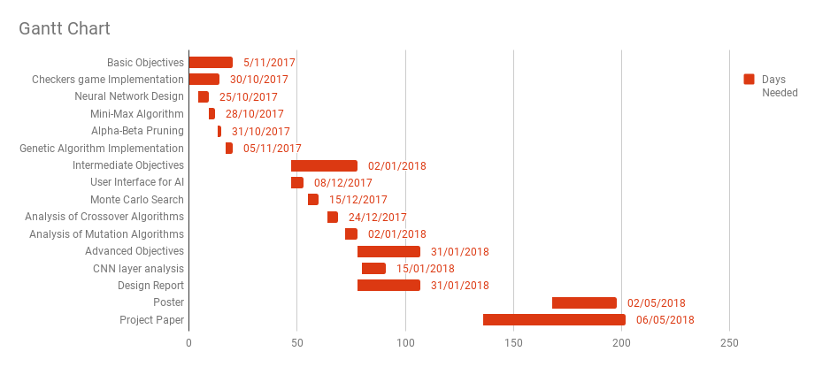

# Project Plan

Thien Nguyen

Supervisor: Stefan Dantchev

Department of Computer Science,
Durham University

## Description
Draughts AI players are currently designed to play at a fixed ability. While it has produced very competitive and intelligent players, they require tweaks in order to improve its performance. By combining Neural Networks and Genetic Algorithms, this issue could possibly be solved by creating a player that can grow in ability over time.

## Preliminary Preparation
- A primer on the game of Draughts and game strategies for board evaluations
- A cohesive understanding of Convolutional Neural Networks
- A comprehensive understanding of Genetic Algorithms
- A comprehensive understanding of relevant programming languages and/or frameworks that will be needed for implementation.

## Research Question
Can we produce a similarly performant draughts by using seperate classifiers for the different stages of the game?

## Deliverables

### Minimum
- Implement a CNN 
- Implement a Checkers Game Interface
- Implement a genetic algorithm with an evaluation function that consists of a round robin tournament against the population of CNN Evaluators.
- Implement a mini-max algorithm that chooses moves.

### Intermediate
- A user-friendly interface to play against the AI
- A monte-carlo search of the move space.
- Analysis of Crossover methods (within Genetic Algorithms)
- Analysis of Mutaiton methods (within Genetic Algorithms)

### Advanced
- Convolutional Neural Network Layer analysis
- The resulting AI can play to an ELO of at least 1200.

## Project Plan

For each of the objectives, it would not be difficult to adjust the dates due to the flexibility of the project; the majority of the basic objectives can be implemented without dependency on others. It may be the case that the minimum subobjectives can be implemented in parallel.

Due to the nature of the project, various tweaks will need to be applied to the different components of the system to optimise performance. However, this is left for the intermediate and advanced objectives, where it is assumed that it would be made possible during the system implementation during the basic objectives.

